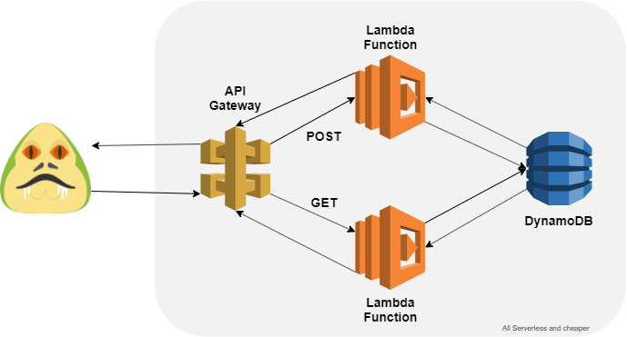

# APIgateway-lambda-dynamodb

First, its important to know some topics before explain what are we doing with this files:

### Serverless computing
Serverless is the native architecture of the cloud that enables you to shift more of your operational responsibilities to AWS, increasing your agility and innovation. Serverless allows you to build and run applications and services without thinking about servers. It eliminates infrastructure management tasks such as server or cluster provisioning, patching, operating system maintenance, and capacity provisioning. You can build them for nearly any type of application or backend service, and everything required to run and scale your application with high availability is handled for you.

### AWS service: Lambda
AWS Lambda lets you run code without provisioning or managing servers. You pay only for the compute time you consume - there is no charge when your code is not running.

For more information <a href="https://aws.amazon.com/lambda/">click here</a>.

### AWS service: API Gateway
Amazon API Gateway is a fully managed service that makes it easy for developers to create, publish, maintain, monitor, and secure APIs at any scale. With a few clicks in the AWS Management Console, you can create REST and WebSocket APIs that act as a “front door” for applications to access data, business logic, or functionality from your backend services, such as workloads running on Amazon Elastic Compute Cloud (Amazon EC2), code running on AWS Lambda, any web application, or real-time communication applications.

For more information <a href="https://aws.amazon.com/apigateway/">click here</a>.

### AWS service: DynamoDB
Amazon DynamoDB is a key-value and document database that delivers single-digit millisecond performance at any scale. It's a fully managed, multiregion, multimaster, durable database with built-in security, backup and restore, and in-memory caching for internet-scale applications. DynamoDB can handle more than 10 trillion requests per day and can support peaks of more than 20 million requests per second.

For more information <a href="https://aws.amazon.com/dynamodb/">click here</a>.

## What does this CloudFormation file do:

This proyect works with 4 cloudformation nested stacks.

- The IAM stack, basically it will create a role to let us access to the data base from the lambda function.

- The DynamoDB stack will create a table named Numbers with a single column value named Number. 

- The APIgateway stack will create two different methods, POST and GET, both belongs to the 'Number' resource. 

- The lambda stack will deploy 2 differents functions, one will write a number in the dynamodb that we create before and the other function will return all the registers in the table.

- The main stack is in charge to link all the stacks and send them all the parameters needed.

## Cool Diagram:

  

## How to use it:

1. Create a S3 bucket and upload all the files. (Dont forget to upload the zip files, those files contain the code for the lambda functions.) 

2. Go to CloudFormation service and select create a stack.

3. Select template is ready and Amazon S3 URL and copy the main.yml url of your S3 bucket.

4. Fill the parameters.

5. Select next and wait a few minutos.

Then you will see that all the specified resources and services are created.
